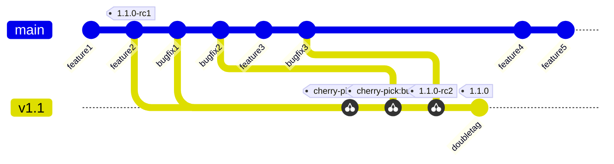

# ADR 0002: Use GitHub Flow for Branching Strategy

|                |                       |
| -------------- | --------------------- |
| Date           | 4/19/2023             |
| Scope          |                       |
| Status         | implemented           |
| Authors        | [Kevin](@KPostOffice) |
| Supersedes     | N/A                   |
| Superseded by: | N/A                   |
| Issues         |                       |
| Other docs:    | none                  |

## What

We need to choose a branching strategy for our software development project that allows us to deliver features and bug
fixes quickly and reliably. There are several popular branching models, such as GitFlow, Trunk Based Development, and
GitHub Flow. Each model has its own advantages and disadvantages, depending on the project size, complexity, release
frequency, and team collaboration.

## Why

We have a few projects now with no accepted development strategy and release cadence. We need to make sure that
developers have an idea of how to get changes into the main branch and when they can expect changes to be released into
a new version as well as ways of pulling bugfixes into existing releases.

## Goals

- Create a branching and release strategy that is followed across all of our sub projects
- Enable flexible release schedules as some projects may have a different release cadence from others.
- A branching strategy which allows for CI/CD .
- A way to add bugfixes to existing releases.

## How

### Decision

We have decided to use GitHub Flow as our branching strategy. GitHub Flow is a simple and lightweight model that follows
these principles:

- The `main` branch is always deployable and represents the latest version of the code.
- New features and bug fixes are developed in short-lived branches, created from the `main` branch.
- When a branch is ready for review, a pull request is opened to merge it into the `main` branch.
- After the pull request has both an `approved` and `lgtm` label, it is merged into the `main` branch and all necessary
images and artifacts are pushed to indexes where they can be used for deployment in dev/latest environments.
- If a bugfix is required for any release, the bugfix is added using the above process and then cherry-picked into the
  branch for the minor release. (explained below)

### Rationale

- It is simple and easy to understand and follow. There is no need to maintain multiple long-lived branches or deal with
  complex merge conflicts.
- It supports continuous integration and delivery. Every commit on the `main` branch is tested and deployable, ensuring
  high quality and fast feedback.
- It encourages collaboration and code review. Pull requests are the central place for discussing and reviewing code
  changes, ensuring that every change is approved by at least one other developer before merging.
- It allows us to release frequently and incrementally. We can deploy new features and bug fixes as soon as they are
  ready, without waiting for a predefined release cycle or schedule.

### How to pull in bug fixes into a release branch

Sometimes, we may need to create a release branch from the `main` branch to prepare for a major or minor release. For
example, we may want to freeze the feature set for a certain version and only allow bug fixes on that branch. In that
case, we can use the following steps to pull in bug fixes from the `main` branch into the release branch:

- Create a release branch from the `main` branch with a name that indicates the minor version number, such as `v1.2` or 
  `release-v1.2`.
- Continue developing new features and bug fixes on the `main` branch as usual.
- If a bug fix on the `main` branch needs to be included in the release branch, cherry-pick the commit that contains the
  fix onto the release branch.
- When the branch is ready for a new release, create a tag on GitHub with the patch version incremented. For example if
  `v1.2.0` is the last released version for `v1.2`, then the new tag will be `v1.2.1`. This will trigger the release
  pipeline for that tag.

### Release process

The release process for our project is very simple and consists of creating a version tag on GitHub. For example, if we
want to release version 1.3 of our software, we just need to create a tag named `v1.3.0` on GitHub from the latest
commit on the `main` branch. This will trigger the build and release pipelines, or someone will manually take the
required steps for generating build artifacts, etc..

We do not need to create major version tags unless there is a significant change in the software architecture or
functionality that requires a major version bump.

### Release candidates (Optional)

When developing, all programmers like to think themselves infallible and that their code is bug free. However, the
opposite is a better assumption, that even with stringent testing and careful coding, bugs are inevitable. Therefore,
instead of tagging the first release of a minor version as `1.1.0`, it might be better to mark the first release as
`1.1.0-rc1`; this means that the tag is the first release candidate (rc) for the official `1.1.0` release. This ensures
that users know that the release is unofficial, but allows developers and users to test a new version of a library or
product. Development continues as normal, features are added only to the main branch, but bug fixes are cherry picked
into the `v1.1` branch. Once a release candidate is "stable" (i.e. users and devs can reliably use it bug free) then
that release candidate commit will be tagged again in git as the official release.

### Versioning Scheme

All projects should use semantic versioning scheme as it gives the most warning for potentially breaking changes when
compared to other schemes such as calendar versioning.

### Artifacts

#### Source code

For all releases, the entirety of the repositories source code for that tag should be zipped into an archive and added
to the GitHub artifacts for that release.

#### Changelogs

A changelog that list new features and bugfixes that are part of the release should be present on GitHub. The changelog
should contain all changes starting from the previous patch release (i.e. `1.1.0-rc2` should have the same changelog as
`1.1.0-rc1` plus any bugfixes that have been added).

## Non Goals

- Dictating how to build code for release (prefer automation, but a manual process is also okay)
- Setting a release cycle for the CodeFlare project.

## Open questions

- What artifacts should be built to go alongside the releases? For example, should we generate documentation, binaries,
  packages, etc.?
- How will container images be scanned to ensure vulnerabilities are being discovered early and often?
- How should we communicate our releases to our stakeholders and customers? Should we use changelogs, release notes,
  newsletters, etc.?

## Alternatives

### Git Flow

GitFlow is no longer a popular branching and release strategy as it requires more overhead with branch management and
more involved merging. One benefit that it does offer is a slower dev process for junior devs.

### Trunk Based Development (TBD)

TBD and GitHub flow are very similar in that they treat the main branch as a deployable branch that all feature branches
and bug fixes should branch from. The main difference comes with expectations on how often developers pull changes into
the repo. TBD discourages branches living longer than a couple of days, any features that are unfinished or untested are
gated using feature flags. GitHub Flow encourages thorough testing before merging anything into the main branch. TBD is
difficult to implement in an open source community where many developers don't have direct access to the main branch, or
an easy way to get one on one time with a maintainer to do a code review.

## Risks

GitHub Flow and Trunk Based Development both require discipline keeping tests up to date and ensuring that the `main`
branch is always in a deployable state.

## Stakeholder Impacts

| Group              | Key Contacts       | Date      | Impacted? |
| ------------------ | ------------------ | --------- | --------- |
| CodeFlare SDK      | Mustafa Eyceoz     | 4/19/2023 | yes       |
| MCAD               | Abhishek Malvankar | 4/19/2023 | yes       |
| InstaScale         | Abhishek Malvankar | 4/19/2023 | yes       |
| CodeFlare Operator | Anish Asthana      | 4/19/2023 | yes       |

## References

* https://docs.github.com/en/get-started/quickstart/github-flow
* https://trunkbaseddevelopment.com/
* https://www.atlassian.com/git/tutorials/comparing-workflows/gitflow-workflow

## Reviews

| Reviewed by   | Date | Notes |
| ------------- | ---- | ----- |
| Anish Asthana | 4/21 |       |
| Alex Corvin   | 4/20 |       |
