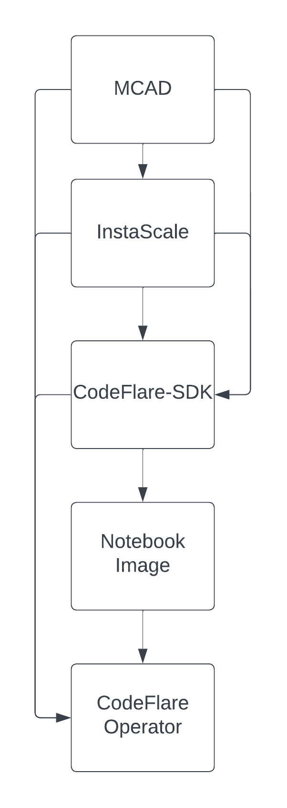

# Standardized release process for Project CodeFlare

|                |                                                              |
| -------------- | ------------------------------------------------------------ |
| Date           | 04/28/2023                                                   |
| Scope          |                                                              |
| Status         | implemented                                                  |
| Authors        | [Anish Asthana](@anishasthana) [Mustafa Eyceoz](@Maxusmusti) |
| Supersedes     | N/A                                                          |
| Superseded by: | N/A                                                          |
| Issues         |                                                              |
| Other docs:    | PCF-ADR-002                                                  |

## What

This ADR introduces a unified release process, testing, and versioning scheme for Project CodeFlare.
[PCF-ADR-002](./PCF-ADR-0002-release-story-and-branch-maintenance.md) is a related ADR to this one but is purely supplemental. ADR-002 covers the branching strategy to be used by all components, whereas this ADR is focused on higher
level details.

## Why

Project CodeFlare currently has different release processes and versioning schemes for all of its subprojects. This creates confusion for users when they wish to use the stack -- what components versions should they be using? How do external dependencies like KubeRay factor in?
There are also no standards around testing for the project.
This ADR aims to document the overall release process for Project CodeFlare.

## Goals

* Establish a common versioning scheme for all CodeFlare components
* Establish a release process for Project CodeFlare
* Establish guidelines for CodeFlare support matrix

## Non-Goals

* Require all components to restart versioning from scratch
* Outline technical details for tests or CI infrastructure.

## How

We are proposing a unified release cycle for Project CodeFlare.
We will release a new version of Project CodeFlare after every sprint (currently every 3 weeks), following normal semantic versioning. All components under the CodeFlare umbrella are expected to start using semantic versioning for future releases. Components are not expected to start versioning again from scratch (i.e v0.0.1). As part of a new release for Project CodeFlare, we will update the support matrix which outlines specific component versions and versions for important dependencies such as KubeRay. The components to be documented are as follows:

* CodeFlare Operator
  * The CodeFlare Operator version will be aligned with (i.e equivalent to) the Project CodeFlare version
* CodeFlare SDK
  * The CodeFlare Notebook Image will follow the same versioning.
  * Supported TorchX version will be documented under the SDK.
* InstaScale
* MCAD
* KubeRay
  * On a new KubeRay release, CodeFlare will update it's supported version by the end of the next CodeFlare sprint

### Images

For published images, we are proposing repositories include the following three tags:

1. Stable – Updated once every sprint as part of an official release
2. dev – Updated every time a new PR is merged into the main branch of a repository
3. Normal semantic version tags – Created whenever components require a new image to be published. This may happen more than once per sprint.

### Testing

Each component must implement unit and e2e tests that are run on all PRs.
The CodeFlare operator must include an integration test suite that will ensure stability of the overall stack.
In addition to running the integration test suite on every PR to the CodeFlare operator, the integration tests are run nightly in the CodeFlare operator repository using the `dev` tag for all underlying components
Component repositories will not be required to run the integration test suite. This may chagne at a later date once the maturity of Project CodeFlare and the integration test suite increases.

The components themselves have dependencies on each other as well that may result in updates being required for multiple components. For example, an update to the AppWrapper CRD in the MCAD repository will require us to update all the components below it in the chain. On the other hand, the codeflare-sdk will not accept changes that will break integration with MCAD.

With this in mind, we will make sure that the e2e tests for components pull in the `dev` tag for all components above them in the chain. This will help us catch issues earlier in the sprint.

### Release Process

1. Ask components to generate a new release.
    1. This will just be the new semantic version tag.
2. Update image references in CodeFlare Operator repository
    1. Make sure that any CRD updates in the MCAD repository are copied into the CodeFlare operator repository
    2. Once merged, create a new operator image.
3. Generate new operator bundle in CodeFlare Operator
    1. Update the image reference for the bundle
    2. As part of this, we will be testing the latest component versions
    3. Update support matrix in operator README.
4. Create tag in operator repository and update release notes of operator version to include new support matrix.
5. Open a pull request to OpenShift community operators repository with latest bundle.
6. Once merged, update component stable tags to point at the latest image release.
7. Announce the new release in slack and mail lists, if any.
8. Update the Distributed Workloads component in ODH.
    1. At a minimum, we will need to update the README for Distributed Workloads to refer to the latest versions of each component
    2. Updates could include custom resources, KubeRay version, or usage/installation instructions.
    3. Update needs to occur within a week of CodeFlare release
    4. Make sure that the platform SIG is aware of these updates, so that the ODH release notes are updated as expected

Hotfix Process?
If a critical issues is discovered requiring an out-of-band release, we will follow the normal release process, bumping up the z stream version for Project CodeFlare as well as the related component.

## Open Questions

1. How does versioning and releases for the distributed workloads component for ODH fit into this?
    * Currently thinking it will just follow Project CodeFlare versions.
2. Do we want to include a code/feature freeze date?
    * Leaning towards keeping this window as small as possible – something like 2 days before the end of a given sprint.
3. There’s work ongoing to include ui integrations for MCAD in the odh-dashboard. How does that fit into our release process?
4. There’s a lot of scope for automation improvements as well as testing additions. How do we prioritize these inclusions?
5. The CodeFlare operator currently uses pinned versions for component references, should we just use the component "stable" tags instead?
    * Currently thinking "No" -- using explicit version references makes it very clear what version of what component is included in a given release of the stack.

## Alternatives

We didn't consider any other alternatives

## Stakeholder Impacts

| Group              | Key Contacts       | Date       | Impacted? |
| ------------------ | ------------------ | ---------- | --------- |
| CodeFlare SDK      | Mustafa Eyceoz     | 04/28/2023 | yes       |
| MCAD               | Abhishek Malvankar | 04/28/2023 | yes       |
| InstaScale         | Abhishek Malvankar | 04/28/2023 | yes       |
| CodeFlare Operator | Anish Asthana      | 04/28/2023 | yes       |

## Reviews

Reviews on the pull request will suffice for the approval process. At least 2 approvals are required prior to this ADR being merged. The ADR must also remain open for at least one week.
