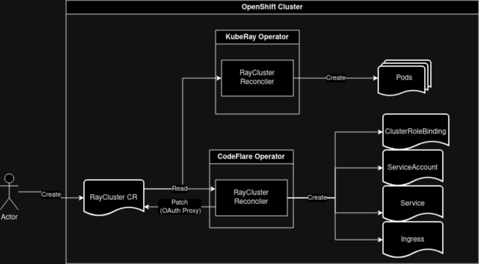

# Project CodeFlare - RayCluster Authentication
|                |                                                                                  |
| -------------- | -------------------------------------------------------------------------------- |
| Date           | 12/19/2023                                                                       |
| Scope          |                                                                                  |
| Status         | provisional                                                                      |
| Authors        | [Kevin Postlethwait](@KPostOffice)                                               |
| Supersedes     | N/A                                                                              |
| Superseded by: | N/A                                                                              |
| Issues         |                                                                                  |
| Other docs:    | none                                                                             |

## What

Enabling OpenShift OAuth as an identity provider and authorization mechanism for KubeRay RayClusters.

## Why

Currently there is no authentication by default enabled in front of the Ray Dashboard and we would like to offer a
unified login experience for the whole of ODH by way of OpenShift OAuth

## Goals

* Protect the dashboard from unauthenticated access by way of an OAuth flow
* Protect the API endpoint from unauthenticated access by way of bearer tokens
* Enable HTTPS by default for accessing the RayCluster API and Dashboard
* Support authenticated interactive session

## Non-Goals

* Creating a fully customizable auth(z) solution

## How

In order to solve this we will add a RayCluster reconciler which creates the necessary resources for enabling
enabling authentication and authorization in front of the API and dashboard.

This will change in Q1 or early Q2 of 2024 with the introduction of Authorino. The overall design stays the same, but
the resources created by the CodeFlare Operator's RayCluster reconciler will change and there will likely no longer be
a need for adding the OAuth Proxy sidecar to the head node definition.

### TLS certificates

https://docs.openshift.com/container-platform/4.11/security/certificate_types_descriptions/service-ca-certificates.html

### Mutating Webhook

A mutating webhook will be used in order to add the OAuth sidecar to the head node, change the head services exposed,
and add annotations for TLS certificates. There will need to be OAuth proxies for `dashboard` and `client` ports.

### CFO RayCluster Controller

The RayCluster Controller in the CFO will create the other necessary kubernetes objects (CRB, Service, ServiceAccount,
Ingress/Route)

## Gaps

* KubeRay does not authenticate when communicating with the Jobs API. Until we use ServiceMesh, which can specify rules
for which pods can communicate with each other, we need the controller to authenticate using the KubeRay service account
by default. We can see if these changes will be readily accepted upstream.

* Ray CLI does not support setting headers for authentication

## Open Questions

* how to report status of objects created by CFO? (Should we rely on annotations?). Could we create a CRD which is owned
by the RayCluster that just reports the status? 

* Will the Ray CLI work with the new authenticated endpoint? (short answer is no due to the stated blocker)? The open
question is, will gRPC protocol work?

## Alternatives

* Make changes directly to downstream KubeRay operator
* Add the reconciler to the ODH operator
* Use a mutating webhook for adding the OAuth proxy sidecar to the headnode spec
* Implement a more generic solution upstream

## Risks

If authenticated requests in KubeRay operator and Ray CLI aren't accepted we need to have work arounds for customers.

## Stakeholder Impacts

| Group                  | Key Contacts        | Date | Impacted? |
| ---------------------- | ------------------- | ---- | --------- |
| CodeFlare SDK          | Dimitri Saridakis   | date | ?         |
| CodeFlare Operator     | Antonin Stefanutti  | date | ?         |

## Reviews

Reviews on the pull request will suffice for the approval process. At least 2 approvals are required prior to this ADR being merged. The ADR must also remain open for at least one week.
